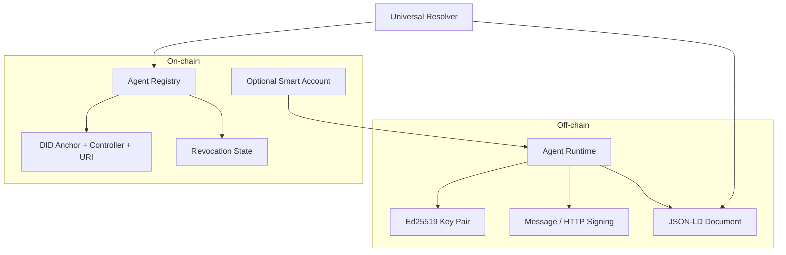

# RFC-001: Agent-DID (Unified Specification)

## Document Status

- **Status:** Public Review v1 (open for community feedback)
- **Version:** 0.2-unified-public-review-v1
- **Date:** 2026-04-25
- **Scope:** This RFC is the canonical and sole document for the Agent-DID specification. It includes the data model, reference architecture, and SDK implementation guidelines.
- **Feedback:** Use the RFC feedback issue template or GitHub Discussions for public review. Report vulnerabilities privately through [SECURITY.md](../SECURITY.md).

---

## 1. Summary

Agent-DID defines a verifiable cryptographic identity for autonomous AI agents. Its goal is to allow any actor (human, organization, API, or agent) to reliably verify:

1. Who controls the agent.
2. What "brain" it runs (model/base prompt) without exposing sensitive IP.
3. What capabilities or certifications it declares.
4. Whether its identity is active, evolved, or revoked.

The standard extends W3C DIDs/VCs with AI-specific metadata and adopts a hybrid off-chain/on-chain architecture to balance cost, speed, and trust.

---

## 2. Relationship with Existing Standards

- **W3C DID / DID Document:** Foundation for decentralized identity.
- **W3C Verifiable Credentials (VC):** Support for compliance certifications.
- **ERC-4337 / Account Abstraction (optional):** Autonomous account for agent payments and economic operations.
- **HTTP Message Signatures / Web Bot Auth (emerging):** HTTP request signing for A2A/API authentication.

Agent-DID does not replace these standards; it orchestrates them for the specific case of autonomous agents.

---

## 3. Design Principles

1. **Persistent identity, mutable state:** The DID remains stable; the document can evolve.
2. **Minimal on-chain data:** Only anchoring and revocation; full metadata in decentralized storage.
3. **Strong cryptography by default:** Ed25519 recommended for frequent signing.
4. **Blockchain-agnostic:** Compatible with multiple networks, with reference implementations on EVM.
5. **Interoperability:** JSON-LD schema and universal resolution.

---

## 4. Agent-DID Document Structure

### 4.1 Base JSON-LD Schema

```json
{
  "@context": ["https://www.w3.org/ns/did/v1", "https://agent-did.org/v1"],
  "id": "did:agent:polygon:0x1234...abcd",
  "controller": "did:ethr:0xCreatorWalletAddress",
  "created": "2026-02-22T14:00:00Z",
  "updated": "2026-02-22T14:00:00Z",
  "agentMetadata": {
    "name": "SupportBot-X",
    "description": "Level 1 technical support agent",
    "version": "1.0.0",
    "coreModelHash": "hash://sha256/... or ipfs://...",
    "systemPromptHash": "hash://sha256/... or ipfs://...",
    "capabilities": ["read:kb", "write:ticket"],
    "memberOf": "did:fleet:0xCorporateSupportFleet"
  },
  "complianceCertifications": [
    {
      "type": "VerifiableCredential",
      "issuer": "did:auditor:0xTrustCorp",
      "credentialSubject": "SOC2-AI-Compliance",
      "proofHash": "ipfs://Qm..."
    }
  ],
  "verificationMethod": [
    {
      "id": "did:agent:polygon:0x1234...abcd#key-1",
      "type": "Ed25519VerificationKey2020",
      "controller": "did:ethr:0xCreatorWalletAddress",
      "publicKeyMultibase": "z6Mk...",
      "blockchainAccountId": "eip155:1:0xAgentSmartWalletAddress"
    }
  ],
  "authentication": ["did:agent:polygon:0x1234...abcd#key-1"]
}
```

### 4.2 Normative Field Definitions

| Field | Requirement | Description |
| :--- | :--- | :--- |
| `id` | **REQUIRED** | Unique agent DID (`did:agent:<network>:<id>`). |
| `controller` | **REQUIRED** | DID or identifier of the human/corporate controller. |
| `created` / `updated` | **REQUIRED** | ISO-8601 timestamps of the document. |
| `agentMetadata.coreModelHash` | **REQUIRED** | Immutable hash/URI of the base model. |
| `agentMetadata.systemPromptHash` | **REQUIRED** | Immutable hash/URI of the base prompt. |
| `verificationMethod` | **REQUIRED** | Valid public keys for signature verification. |
| `verificationMethod[].deactivated` | OPTIONAL | ISO-8601 timestamp marking when a key was deactivated via rotation. Deactivated keys remain in the document for historical signature verification. |
| `authentication` | **REQUIRED** | References to valid authentication methods. |
| `complianceCertifications` | OPTIONAL | VC evidence and audits. |
| `agentMetadata.capabilities` | OPTIONAL | Declared/authorized capabilities. |
| `agentMetadata.memberOf` | OPTIONAL | Link to agent fleet/cohort. |

---

## 5. Reference Architecture

### 5.1 Hybrid Model (off-chain / on-chain)



### 5.2 Mandatory Components

1. **Agent Registry (on-chain or equivalent):** DID registration/revocation.
2. **Universal Resolver:** DID → full document resolution.
3. **Client SDK:** creation, signing, verification, and lifecycle operations.

### 5.3 On-chain vs Off-chain

- **Minimal on-chain:** DID, controller, document reference, revocation state.
- **Off-chain:** full JSON-LD document, extensive VCs, metadata not critical for consensus.
- **Recommended production resolution profile:** HTTP/IPFS and JSON-RPC sources with multiple endpoints/gateways, TTL cache, resolution telemetry, and transient error failover.
- **HA operational guide:** see `docs/RFC-001-Resolver-HA-Runbook.md` for SLO, alerts, and resilience drills.

---

## 6. Normative Operational Flows

### 6.1 Registration

1. The controller generates the DID and agent keys.
2. A JSON-LD document is built with model/prompt hashes.
3. The DID reference and its controller are anchored in the registry.

### 6.2 Resolution and Verification

1. Consumer obtains `Signature-Agent` or the issuer's DID.
2. Resolves DID via universal resolver (with fallback/failover in production profile).
3. Verifies signature with `verificationMethod`.
4. Verifies non-revoked state in registry.

### 6.3 Evolution

1. The DID remains stable.
2. `updated` and hashes change in the new document version.
3. Registry points to the new document reference.

### 6.4 Revocation

1. The controller (or defined policy) marks the DID as revoked.
2. All subsequent verifications must fail for active authentication.
3. In the reference EVM deployment, the contract policy allows revocation by `owner` or DID-authorized delegate, with explicit ownership transfer.

### 6.5 HTTP Signing (Web Bot Auth)

- The agent signs HTTP components (`@request-target`, `host`, `date`, `content-digest`).
- Must include an agent identity header (`Signature-Agent` or equivalent).
- The server validates signature + DID + revocation state before authorizing.

---

## 7. SDK Implementation Guidelines (Reference)

The reference SDK (TypeScript/Python) must expose at minimum:

1. `create(params)`
2. `signMessage(payload, privateKey)`
3. `signHttpRequest(params)`
4. `resolve(did)`
5. `verifySignature(did, payload, signature)`
6. `revokeDid(did)`

### 7.1 Reference Contract/Registry (EVM)

Recommended minimum ABI:

```solidity
function registerAgent(string did, string controller) external;
function revokeAgent(string did) external;
function getAgentRecord(string did)
  external
  view
  returns (string did, string controller, string createdAt, string revokedAt);
function isRevoked(string did) external view returns (bool);
```

### 7.2 Interoperability Fixtures

To validate verification compatibility between implementations, maintain versioned shared vectors (message and HTTP signatures) and run them in CI.

Current fixture reference:

- `sdk/tests/fixtures/interop-vectors.json`
- `sdk/tests/InteropVectors.test.ts`

### 7.3 Quick Mapping: RFC → SDK

| RFC Flow | Reference SDK API/Artifact |
| :-- | :-- |
| Identity Registration (6.1) | `AgentIdentity.create(params)` |
| Payload Signing (6.2) | `signMessage(payload, privateKey)` |
| HTTP Signing (6.5) | `signHttpRequest(params)` |
| DID Resolution (6.2) | `AgentIdentity.resolve(did)` |
| Signature Verification (6.2) | `AgentIdentity.verifySignature(...)` and `verifyHttpRequestSignature(...)` |
| Historical Signature Verification (6.2b) | `AgentIdentity.verifyHistoricalSignature(did, payload, signature, keyId)` |
| Document Evolution (6.3) | `updateDidDocument(did, patch)` |
| Key Rotation (8.2) | `rotateVerificationMethod(did)` — marks old keys as `deactivated` |
| Revocation (6.4) | `revokeDid(did)` |
| Production Resolver (5.3) | `useProductionResolverFromHttp(...)`, `useProductionResolverFromJsonRpc(...)` |
| EVM Integration (5.2) | `EthersAgentRegistryContractClient` + `EvmAgentRegistry` |

### 7.4 Minimum End-to-End Flow (Onboarding)

1. Create the agent identity with `create(params)`.
2. Sign a payload with `signMessage`.
3. Verify that payload with `verifySignature` using the issued DID.
4. Resolve the DID with `resolve` and validate active state.
5. Revoke with `revokeDid` and confirm that subsequent verification fails.

Executable examples:

- `sdk/examples/e2e-smoke.js`
- `sdk/examples/evm-registry-wiring.ts`

Recommended full validation command:

- `npm run conformance:rfc001`

### 7.5 Expected Errors and Behavior

- **DID not found:** resolution fails (`DID not found` or resolver equivalent).
- **DID revoked:** `resolve`/`verifySignature` must fail or return invalid.
- **Invalid signature/tampered payload:** verification returns `false`.
- **Incompatible `Signature-Input`:** HTTP verification returns `false`.
- **Unresolvable `documentRef`:** resolver attempts failover; if all fail, error.

---

## 8. Security and Privacy

1. **Do not publish prompts in plaintext:** use verifiable hashes.
2. **Key rotation:** define rotation policy and `verificationMethod` update.
3. **Immediate revocation:** critical requirement for key compromise.
4. **Principle of least privilege:** explicit and bounded capabilities.
5. **Auditing:** maintain evidence of versions and state changes.

---

## 9. Reference Use Cases

1. Independent agents on social/economic platforms.
2. Corporate governance and audited compliance.
3. Massive agent fleets with individual identity.
4. Integration with Zero-Trust APIs via HTTP signing.
5. Agent-to-agent commerce with cryptographic non-repudiation.

---

## 10. Compliance and Conformance

An implementer is considered **RFC-001 conformant** if it:

1. Emits a document compatible with section 4.
2. Implements registration/resolution/verification/revocation flows (section 6).
3. Can demonstrate signature verification against a resolved DID and non-revoked state.
4. Respects the minimum on-chain/off-chain separation described in section 5.3.

---

## 11. RFC Governance

- Major changes: new RFC version (e.g., RFC-002).
- Compatible minor changes: revision of this version (`0.2.x`).
- Any extension must preserve interoperability of the base schema.

### 11.1 Conformance Evaluation

The operational compliance evaluation is maintained in:

- `docs/RFC-001-Compliance-Checklist.md`

---

## 12. Operational Glossary

- **Controller:** human/organizational identity that governs the agent in the DID document.
- **Owner (on-chain):** EVM account with operational control of the DID registration in the contract.
- **Delegate:** account authorized by `owner` for revocation actions.
- **DocumentRef:** on-chain reference to the agent's off-chain document.
- **Universal Resolver:** component that combines registry lookup + document retrieval + cache/failover.

---

**License:** MIT
**Canonical document:** `docs/RFC-001-Agent-DID-Specification.md`
