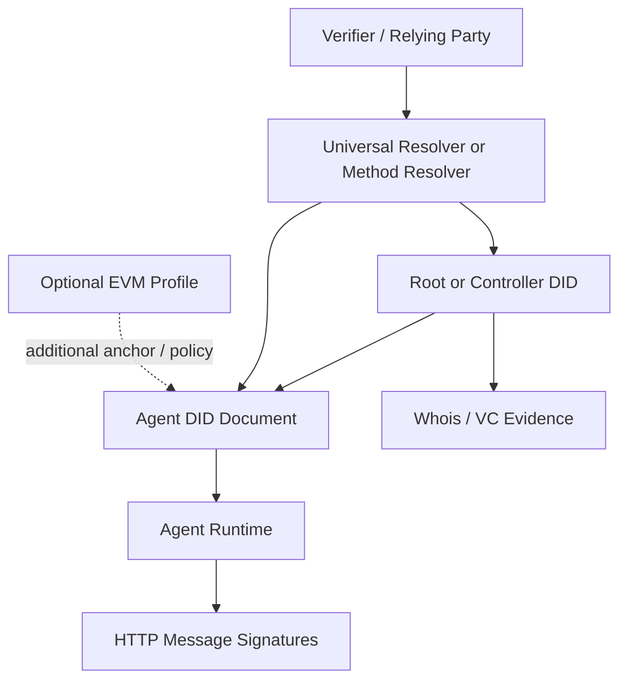

# RFC-001: Agent-DID (Unified Specification)

## Document Status

- **Status:** Public Review v1 (open for community feedback)
- **Version:** 0.3-pivot-pattern-on-webvh
- **Date:** 2026-05-06
- **Scope:** This RFC is the canonical core specification for Agent-DID as an application pattern on top of `did:webvh`, including the data model, composition semantics, runtime authentication profile, and SDK implementation guidelines.
- **Feedback:** Use the RFC feedback issue template or GitHub Discussions for public review. Report vulnerabilities privately through [SECURITY.md](../SECURITY.md).

---

## 1. Summary

Agent-DID defines an application pattern on top of W3C DID documents for autonomous AI agents, with `did:webvh` as the recommended default DID method. Its goal is to allow any actor (human, organization, API, or agent) to reliably verify:

1. Who controls the agent.
2. What "brain" it runs (model/base prompt) without exposing sensitive IP.
3. What capabilities or certifications it declares.
4. Whether its identity is active, evolved, or revoked.
5. Whether runtime requests were signed by a key authorized for that agent identity.

The standard extends W3C DIDs/VCs with AI-specific metadata, defines an A2A identity composition contract that binds an agent to a human or organizational controller, and specifies a runtime authentication profile based on HTTP Message Signatures plus anti-replay controls. `did:webvh` is the normative reference method because it provides web-native discoverability and verifiable history; other DID methods MAY be supported as compatibility profiles when they preserve the same composition and verification semantics. EVM anchoring remains available as an optional deployment profile for environments that need additional on-chain immutability.

Agent-DID's conformance scope is deliberately limited to identity, controller/delegation semantics, and runtime signature authorization. A conforming implementation proves who had standing to make a call and whether the signing key was authorized for that action; it does **not** by itself prove that the agent's reasoning was correct or capture the full decision state that led to a call. Those concerns belong to a separate decision-provenance layer, such as signed execution receipts or trace attestations.

---

## 2. Relationship with Existing Standards

- **W3C DID / DID Document:** Foundation for decentralized identity.
- **`did:webvh`:** Recommended default method for agent identifiers, controller chains, and verifiable DID history.
- **W3C Verifiable Credentials (VC):** Support for compliance certifications.
- **`/whois` + organizational evidence (recommended pattern):** Publishes legal-entity and governance evidence that an agent verifier can recurse to.
- **HTTP Message Signatures / Web Bot Auth (emerging):** HTTP request signing for A2A/API authentication.
- **ERC-4337 / Account Abstraction (optional):** Additional deployment profile for autonomous account and economic operations.

Agent-DID does not replace these standards and does not define a new DID method. It composes them for the specific case of autonomous agents by standardizing AI-specific metadata, controller relationships, verification behavior, and runtime signing expectations.

---

## 3. Design Principles

1. **Persistent identity, mutable state:** The DID remains stable; the document can evolve.
2. **Method-aligned default:** `did:webvh` is the default and recommended DID method for normative examples and conformance guidance.
3. **Strong cryptography by default:** Ed25519 recommended for frequent signing.
4. **Composition over method invention:** Agent-DID adds application-layer semantics on top of existing DID methods rather than defining a new method.
5. **Deployment-profile flexibility:** Web-native deployment is the default; optional profiles such as EVM MAY add stronger anchoring where justified.
6. **Interoperability:** JSON-LD schema, method-aware resolution, and deterministic verification behavior across SDKs.

---

## 4. Agent-DID Document Structure

### 4.1 Base JSON-LD Schema

```json
{
  "@context": ["https://www.w3.org/ns/did/v1", "https://agent-did.org/v1"],
  "id": "did:webvh:example.com:agents:supportbot-x",
  "controller": "did:webvh:example.com:organizations:acme-support",
  "created": "2026-02-22T14:00:00Z",
  "updated": "2026-02-22T14:00:00Z",
  "agentMetadata": {
    "name": "SupportBot-X",
    "description": "Level 1 technical support agent",
    "version": "1.0.0",
    "coreModelHash": "hash://sha256/... or ipfs://...",
    "systemPromptHash": "hash://sha256/... or ipfs://...",
    "capabilities": ["read:kb", "write:ticket"],
    "memberOf": "did:fleet:0xCorporateSupportFleet"
  },
  "complianceCertifications": [
    {
      "type": "VerifiableCredential",
      "issuer": "did:webvh:trust.example:auditors:trustcorp",
      "credentialSubject": "did:webvh:example.com:agents:supportbot-x",
      "proofHash": "ipfs://Qm..."
    }
  ],
  "verificationMethod": [
    {
      "id": "did:webvh:example.com:agents:supportbot-x#key-1",
      "type": "Ed25519VerificationKey2020",
      "controller": "did:webvh:example.com:organizations:acme-support",
      "publicKeyMultibase": "z6Mk..."
    }
  ],
  "assertionMethod": ["did:webvh:example.com:agents:supportbot-x#key-1"],
  "authentication": ["did:webvh:example.com:agents:supportbot-x#key-1"]
}
```

### 4.2 Normative Field Definitions

| Field | Requirement | Description |
| :--- | :--- | :--- |
| `id` | **REQUIRED** | Unique agent DID. `did:webvh:...` is the recommended/default identifier form; other DID methods MAY be used if they preserve the composition and verification semantics in this RFC. |
| `controller` | **REQUIRED** | DID of the human, organizational, or higher-level agent controller. A resolvable `did:webvh` controller is RECOMMENDED for the canonical pattern. |
| `created` / `updated` | **REQUIRED** | ISO-8601 timestamps of the document. |
| `agentMetadata.coreModelHash` | **REQUIRED** | Immutable hash/URI of the base model. |
| `agentMetadata.systemPromptHash` | **REQUIRED** | Immutable hash/URI of the base prompt. |
| `verificationMethod` | **REQUIRED** | Valid public keys for signature verification. |
| `verificationMethod[].deactivated` | OPTIONAL | ISO-8601 timestamp marking when a key was deactivated via rotation. Deactivated keys remain in the document for historical signature verification. |
| `assertionMethod` | **REQUIRED** for signing flows | References to keys authorized for payload and HTTP signature verification by default. |
| `authentication` | **REQUIRED** | References to valid authentication methods. |
| `complianceCertifications` | OPTIONAL | VC evidence and audits. |
| `agentMetadata.capabilities` | OPTIONAL | Declared/authorized capabilities. |
| `agentMetadata.memberOf` | OPTIONAL | Link to agent fleet/cohort. |

---

## 5. Reference Architecture

### 5.1 Web-Native Reference Model


```mermaid
graph TD
  A[Root or Controller DID] --> B[Agent DID Document]
  A --> C[Whois / VC Evidence]
  B --> D[Agent Runtime]
  D --> E[HTTP Message Signatures]
  F[Verifier / Relying Party] --> G[Universal Resolver or Method Resolver]
  G --> A
  G --> B
  H[Optional EVM Profile] -. additional anchor / policy .-> B
```

### 5.2 Mandatory Components

1. **Resolvable controller chain:** A verifier can resolve the agent DID and its controlling DID or equivalent authority chain.
2. **Agent DID document:** Includes `agentMetadata`, verification methods, and the DID verification relationships required for signing.
3. **Resolver path:** Universal resolver or method-native resolution that can obtain the current DID document and, where supported, verifiable history.
4. **Client SDK:** creation, signing, verification, rotation, revocation/deactivation handling, and composition-aware lifecycle operations.

### 5.3 Deployment Profiles

- **Default profile:** `did:webvh` over web-hosted DID history and documents, with controller recursion and VC-backed organizational evidence.
- **Compatibility profile:** Other DID methods such as `did:web`, `did:key`, or `did:ethr`, provided the verifier can still resolve the document and enforce the semantics of this RFC.
- **Optional EVM profile:** Additional anchoring, registry, or smart-account behavior for environments that require on-chain immutability. See `docs/RFC-001-EVM-Profile.md`.
- **Recommended production resolution profile:** Use method-appropriate HTTPS, IPFS, and/or JSON-RPC sources with multiple endpoints/gateways, TTL cache, resolution telemetry, and transient error failover.
- **HA operational guide:** see `docs/RFC-001-Resolver-HA-Runbook.md` for SLO, alerts, and resilience drills.

---

## 6. Normative Operational Flows

### 6.1 Registration

1. The controller generates the DID and agent keys.
2. A JSON-LD document is built with model/prompt hashes.
3. The DID document and, where applicable, its method-specific history are published so a verifier can resolve the agent and its controller chain.

### 6.2 Resolution and Verification

1. Consumer obtains `Signature-Agent` or the issuer's DID.
2. Resolves DID via universal resolver (with fallback/failover in production profile).
3. Verifies the signing key is authorized for the required DID verification relationship.
4. Verifies signature with `verificationMethod`.
5. Verifies the DID is currently active according to the underlying DID method or declared deployment profile.

#### 6.2.1 Verification Relationship Binding

Signature verification is not complete when the public key is merely present in `verificationMethod`. A verifier MUST confirm that the key ID is also listed in the DID verification relationship required by the action being verified.

The default signing purpose for Agent-DID payloads and HTTP signatures is `assertionMethod`. Other signing flows MAY require `authentication`, `capabilityDelegation`, or `capabilityInvocation`. A key listed only under `keyAgreement` MUST NOT be accepted for signing or proof verification.

When a key exists in the DID document but is not authorized for the requested purpose, SDKs MUST raise or surface a deterministic `key_purpose_violation` reason and, where practical, include the relationships where the key was found.

#### 6.2.1.1 Identity Composition Error Shape

To enable cross-implementation interop and programmatic verifiers, conforming SDKs MUST expose identity-composition errors with the following normative shape:

- `reason` (REQUIRED): one of the deterministic identity-composition reasons: `key_purpose_violation`, `rotation_window_closed`, `emergency_revoked`, `tampered`.
- `keyId` / `key_id` (REQUIRED): verification method identifier that triggered the failure (empty string when not applicable).
- `requiredPurpose` / `required_purpose` (REQUIRED): DID verification relationship the action required.
- `foundIn` / `found_in` (REQUIRED): verification relationships where the key was actually listed (MAY be empty).
- `did` (OPTIONAL): subject DID, included when known.

These fields MUST be exposed as direct properties of the error object using the language-idiomatic naming above. Implementations MAY additionally mirror the same fields under a `context` namespace (for example `error.context.keyId`) to interoperate with verifiers that expect a nested error envelope, provided the direct properties remain authoritative. Mirrored values MUST be byte-equal to the direct properties.

The `assertKeyPurpose` helper is a membership-only predicate over the requested verification relationship and MUST NOT short-circuit on `keyAgreement`. The signing-purpose policy that rejects `keyAgreement` for signing flows lives in `assertSigningPurpose` (or the equivalent entry point) and is invoked by the SDK before `assertKeyPurpose` during signature verification.

#### 6.2.1.2 Scope Boundary: Identity vs Decision Provenance

Successful RFC-001 verification proves that the caller identity, controller chain, key authorization, and active-state checks succeeded for the evaluated action. It MUST NOT be interpreted as proof that the underlying planner state, intermediate reasoning, or final decision quality were correct.

Implementations MAY pair Agent-DID verification with a separate signed execution receipt or trace attestation layer. A decision-provenance layer MAY include artifacts such as the tool name, canonicalized input hash, model/prompt/policy version references, trace or span identifiers, timestamps/nonces, and hashes of retrieved context or prior tool outputs.

Raw chain-of-thought capture is out of scope for RFC-001. Implementations that need stronger replayability or compliance evidence SHOULD prefer stable, minimal execution receipts over mandatory disclosure of full internal reasoning text.

### 6.3 Evolution

1. The DID remains stable.
2. `updated` and hashes change in the new document version.
3. A new DID document version or history entry is published according to the underlying DID method.

### 6.4 Revocation

1. The controller (or defined policy) marks the DID as revoked or deactivated according to the underlying DID method/profile.
2. All subsequent verifications must fail for active authentication.
3. In the optional EVM deployment profile, the contract policy MAY additionally allow revocation by `owner` or DID-authorized delegate, with explicit ownership transfer.

### 6.5 HTTP Signing (Web Bot Auth)

- The agent signs HTTP components (`@request-target`, `host`, `date`, `content-digest`).
- Must include an agent identity header (`Signature-Agent` or equivalent).
- The server validates signature + key purpose + DID resolution + active state before authorizing.

---

## 7. SDK Implementation Guidelines (Reference)

The reference SDK (TypeScript/Python) must expose at minimum:

1. `create(params)`
2. `signMessage(payload, privateKey)`
3. `signHttpRequest(params)`
4. `resolve(did)`
5. `verifySignature(did, payload, signature)`
6. `revokeDid(did)`
7. `assertKeyPurpose(keyId, didDoc, requiredPurpose)` / `assert_key_purpose(...)`

### 7.1 Reference Contract/Registry (EVM)

The optional EVM deployment profile is defined in `docs/RFC-001-EVM-Profile.md`. It is not part of the minimum conformance floor for core RFC-001.

### 7.2 Interoperability Fixtures

To validate verification compatibility between implementations, maintain versioned shared vectors (message and HTTP signatures) and run them in CI.

Current fixture reference:

- `sdk/tests/fixtures/interop-vectors.json`
- `sdk/tests/InteropVectors.test.ts`

### 7.3 Quick Mapping: RFC → SDK

| RFC Flow | Reference SDK API/Artifact |
| :-- | :-- |
| Identity Registration (6.1) | `AgentIdentity.create(params)` |
| Payload Signing (6.2) | `signMessage(payload, privateKey)` |
| HTTP Signing (6.5) | `signHttpRequest(params)` |
| DID Resolution (6.2) | `AgentIdentity.resolve(did)` |
| Signature Verification (6.2) | `AgentIdentity.verifySignature(...)` and `verifyHttpRequestSignature(...)` |
| Verification Relationship Binding (6.2.1) | `assertKeyPurpose(...)` / `assert_key_purpose(...)`, default `assertionMethod` |
| Historical Signature Verification (6.2b) | `AgentIdentity.verifyHistoricalSignature(did, payload, signature, keyId)` |
| Document Evolution (6.3) | `updateDidDocument(did, patch)` |
| Key Rotation (8.2) | `rotateVerificationMethod(did)` — marks old keys as `deactivated` |
| Revocation (6.4) | `revokeDid(did)` |
| Production Resolver (5.3) | `useProductionResolverFromHttp(...)`, `useProductionResolverFromJsonRpc(...)` |
| Optional EVM Integration (5.3) | `EthersAgentRegistryContractClient` + `EvmAgentRegistry` |

### 7.4 Minimum End-to-End Flow (Onboarding)

1. Create the agent identity with `create(params)`.
2. Sign a payload with `signMessage`.
3. Verify that payload with `verifySignature` using the issued DID.
4. Resolve the DID with `resolve` and validate active state.
5. Revoke with `revokeDid` and confirm that subsequent verification fails.

Executable examples:

- `sdk/examples/quickstart.js`
- `sdk/examples/e2e-smoke.js`

Optional EVM profile example:

- `sdk/examples/evm-registry-wiring.ts`

Recommended full validation command:

- `npm run conformance:rfc001`

### 7.5 Expected Errors and Behavior

- **DID not found:** resolution fails (`DID not found` or resolver equivalent).
- **DID revoked:** `resolve`/`verifySignature` must fail or return invalid.
- **Invalid signature/tampered payload:** verification returns `false`.
- **Wrong key purpose:** verification raises or surfaces `key_purpose_violation` with the relationships where the key was found.
- **Incompatible `Signature-Input`:** HTTP verification returns `false`.
- **Unresolvable DID document or history entry:** resolver attempts failover; if all fail, error.

---

## 8. Security and Privacy

1. **Do not publish prompts in plaintext:** use verifiable hashes.
2. **Key rotation:** define rotation policy and `verificationMethod` update.
3. **Immediate revocation:** critical requirement for key compromise.
4. **Principle of least privilege:** explicit and bounded capabilities.
5. **Auditing:** maintain evidence of versions and state changes.
6. **Do not overclaim signature semantics:** a valid Agent-DID signature proves authorized caller identity, not reasoning correctness or policy soundness.
7. **Reasoning privacy by default:** full chain-of-thought or planner-state disclosure is out of scope; if decision provenance is needed, prefer bounded execution receipts and hashed references.

---

## 9. Reference Use Cases

1. Independent agents on social/economic platforms.
2. Corporate governance and audited compliance.
3. Massive agent fleets with individual identity.
4. Integration with Zero-Trust APIs via HTTP signing.
5. Agent-to-agent commerce with cryptographic non-repudiation.

---

## 10. Compliance and Conformance

An implementer is considered **RFC-001 conformant** if it:

1. Emits a document compatible with section 4.
2. Implements registration/resolution/verification/revocation flows (section 6).
3. Can demonstrate signature verification against a resolved DID, including DID verification relationship enforcement for the signing key.
4. Supports the Agent-DID application pattern on `did:webvh` or on another DID method that preserves the semantics of this RFC.
5. Treats the EVM profile as optional unless the implementation explicitly claims conformance to `RFC-001-EVM-Profile`.

RFC-001 conformance establishes identity/delegation and runtime signature-verification behavior only. It does not, by itself, certify reasoning correctness, planner integrity, or full decision-context capture.

---

## 11. RFC Governance

- Major changes: new RFC version (e.g., RFC-002).
- Compatible minor changes: revision of this version (`0.3.x`).
- Any extension must preserve interoperability of the base schema.

### 11.1 Conformance Evaluation

The operational compliance evaluation is maintained in:

- `docs/RFC-001-Compliance-Checklist.md`

---

## 12. Operational Glossary

- **Controller:** human/organizational identity that governs the agent in the DID document.
- **Root DID:** higher-level DID, typically organizational or legal-entity bound, from which trust in the agent can be recursively established.
- **Owner (EVM profile):** EVM account with operational control of the DID registration in the optional contract profile.
- **Delegate (EVM profile):** account authorized by `owner` for revocation actions in the optional contract profile.
- **DocumentRef:** method-specific reference to the agent's DID document or history artifact.
- **Universal Resolver:** component that combines DID resolution, document retrieval, and cache/failover across one or more supported methods.

---

**License:** MIT
**Canonical document:** `docs/RFC-001-Agent-DID-Specification.md`
