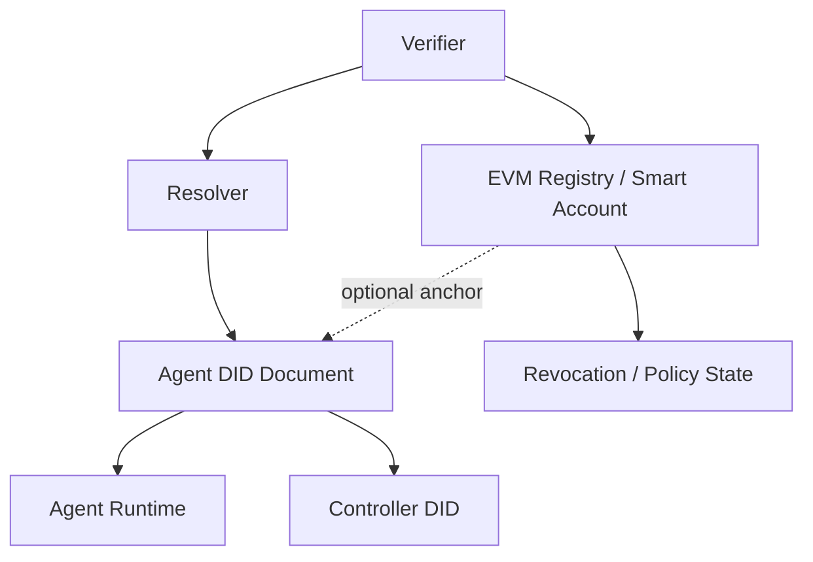

# RFC-001 EVM Profile

## Document Status

- **Status:** Draft
- **Version:** 0.3-pivot-pattern-on-webvh
- **Date:** 2026-05-06
- **Scope:** Optional deployment profile for implementations that add EVM anchoring, registry policy, or smart-account behavior on top of core RFC-001.
- **Parent specification:** [RFC-001-Agent-DID-Specification.md](RFC-001-Agent-DID-Specification.md)

---

## 1. Purpose

This document defines the optional EVM deployment profile for Agent-DID. It exists for environments that need stronger on-chain anchoring, contract-governed revocation, or smart-account coordination in addition to the web-native default described in RFC-001.

This profile extends core RFC-001. It does not replace it, and it does not reintroduce `did:agent` as a DID method.

---

## 2. When to Use This Profile

Use this profile only when at least one of the following is true:

1. The deployment requires contract-visible revocation or governance state.
2. The agent participates in EVM-native economic flows.
3. An operator needs an on-chain audit trail beyond the guarantees of the base DID method.

For general agent identity, controller recursion, and runtime signing, the default `did:webvh` profile from RFC-001 remains preferred.

---

## 3. Profile Model



The EVM profile is an overlay. The DID document remains the canonical identity artifact, while the contract layer contributes additional policy and anchoring signals.

---

## 4. Minimum Contract Interface

Recommended minimum ABI:

```solidity
function registerAgent(string did, string controller) external;
function revokeAgent(string did) external;
function getAgentRecord(string did)
  external
  view
  returns (string did, string controller, string createdAt, string revokedAt);
function isRevoked(string did) external view returns (bool);
```

Implementations MAY provide a superset of this ABI for ownership transfer, delegates, or richer metadata, as long as the minimum behaviors above remain available.

---

## 5. Profile Requirements

An implementation claiming support for `RFC-001-EVM-Profile` MUST:

1. Continue to satisfy the core requirements of RFC-001.
2. Resolve the DID document through the underlying DID method before trusting contract state.
3. Verify on-chain revocation state in addition to document-level active state.
4. Keep the on-chain contract as an overlay for policy and anchoring, not as a replacement for the DID document semantics.

Implementations MAY expose specialized helpers such as `EthersAgentRegistryContractClient` and `EvmAgentRegistry` to manage this profile.

---

## 6. Conformance Boundary

Core RFC-001 conformance does not require EVM support.

An implementation is considered **RFC-001-EVM-Profile conformant** if it:

1. Meets the core RFC-001 conformance rules.
2. Implements the minimum ABI above or a compatible superset.
3. Verifies contract revocation state when the profile is in use.
4. Documents any additional contract-only behaviors that could affect interoperability.

---

## 7. Implementation Notes

- Reference contracts and audits live under `contracts/`.
- This profile is intended for deployment contexts such as DeFi or policy-heavy multi-agent systems, not for every Agent-DID installation.
- Future profile revisions MUST preserve interoperability with the core DID document and signing semantics defined in RFC-001.